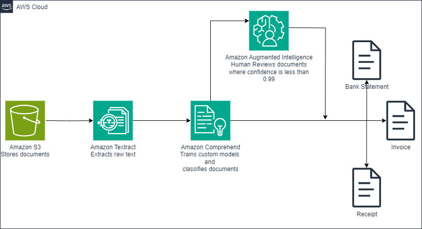

### Intelligent Document Processing
In this lab we will walk through a hands-on lab on document classification using Amazon Comprehend Custom Classifier. We will use Amazon Textract to extract the text from documents, label the documents, the extract text and label as data for training our Amazon comprehend classifier. We use Amazon Comprehend Analysis job to perform batch analysis for our document classification, and sent documents where classification confidence fell below a set threshold for a to human review.

### Solution Overview

- Extract text from legacy image documents using Textract.
- Train Comprehend to classify documents based on the content of the extracted text and document type.
- Classify the document type using the Comprehend custom classifier trained in the previous step.
- Based on the predicted document type, save them to the right category.
- If Comprehend's confidence in the document type is below a certain threshold, send the document to a human for review using A2I.

### Steps
1. Step 1: Setup notebook and upload sample documents to Amazon S3
2. Step 2: Extract text from sample documents using Amazon Textract
3. Step 3: Prepare a CSV training dataset for Amazon Comprehend custom classifier training
4. Step 4: Create Amazon Comprehend Classification training job
5. Step 5: Classify documents with Amazon Comprehend custom classifier
6. Step 6: Amazon Augmented AI

### Benefits
- Decreases human error
- It decreases employee workload, letting them focus on certain edge cases requiring human verification
- Increases scale of enterprise document processing
- Reduce cost of document processing